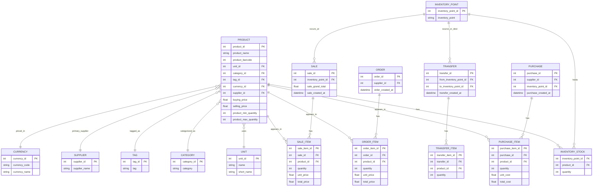

# Inventory Module - Software Requirements Specification (SRS)

Version: 1.0
Status: Draft
Owners: Engineering (Backend/Frontend), Product
Last Updated: 2025-08-26 (UTC+3)

---

## 1. Introduction

### 1.1 Purpose
This SRS defines the requirements for the Inventory module of OAS. It specifies functional and non-functional requirements, interfaces, data, workflows, and constraints, to guide implementation, testing, and maintenance.

### 1.2 Scope
The Inventory module manages products, categories, tags, units, currencies, suppliers, inventory points (warehouses/stores), stock movements, purchases, sales, transfers, alerts, and analytics. It exposes RESTful endpoints under `src/app/api/inventory/` and provides UIs under `src/app/dashboard/inventory/`.

### 1.3 Definitions, Acronyms, Abbreviations
- Inventory Point: Physical location where stock is stored (warehouse, store).
- Inventory Stock: Current on-hand quantity per product per inventory point.
- DTO: Data Transfer Object (validated with Zod).
- NextAuth Session: Authentication session verified through `SessionService.checkIsUserSessionOk()`.

### 1.4 References
- API documentation: `src/modules/inventory/documentation/.md`
- Database schema: `prisma/schema.prisma`
- Inventory services/repositories: `src/modules/inventory/`

---

## 2. Overall Description

### 2.1 Product Perspective
Inventory is a core back-office service integrated with Sales and Purchasing. It persists data via Prisma ORM (MySQL) and authenticates via NextAuth.

### 2.2 User Classes and Characteristics
- Admin: Full access to configure products, masters, and inventory operations.
- Inventory Manager: Manages stock, purchases, transfers, thresholds, and monitors alerts.
- Sales Clerk: Queries availability and performs sales (reduces stock).
- Auditor/Analyst: Read-only access to reports and analytics.

### 2.3 Operating Environment
- Backend: Next.js API routes (Node 18+), Prisma with MySQL.
- Frontend: Next.js app with Material-UI, Tailwind.
- Auth: NextAuth.

### 2.4 Constraints
- Session-required operations must use valid NextAuth session.
- Data integrity enforced by Prisma schema (foreign keys) and Zod DTOs.
- Stock adjustments must be atomic and correctly reflected in `inventory_stock`.

### 2.5 Assumptions and Dependencies
- Currency list is manageable via API; default currency may be pre-seeded.
- Units, categories, tags, suppliers exist before product creation (or created ad-hoc).
- Time-series analytics computed from `sale` and `inventory_stock` tables.

---

## 3. Functional Requirements

Each requirement has an ID for traceability (FR-INV-XXX).

### 3.1 Master Data
- FR-INV-001: System shall support CRUD for Products.
- FR-INV-002: System shall support creation and listing of Categories.
- FR-INV-003: System shall support creation and listing of Tags.
- FR-INV-004: System shall support creation and listing of Units of measure.
- FR-INV-005: System shall support creation and listing of Currencies.
- FR-INV-006: System shall support CRUD for Suppliers.
- FR-INV-007: System shall support CRUD for Inventory Points.

### 3.2 Stock and Movements
- FR-INV-020: System shall maintain `inventory_stock` per product per inventory point.
- FR-INV-021: System shall increase stock on completed Purchases.
- FR-INV-022: System shall decrease stock on completed Sales (with validation to prevent negative stock unless allowed by business rules).
- FR-INV-023: System shall support manual Stock Adjustments (positive or negative) with audit trail.
- FR-INV-024: System shall support Transfers between inventory points, decreasing source and increasing destination atomically.
- FR-INV-025: System shall expose current availability by product and by inventory point.

### 3.3 Orders and Purchases
- FR-INV-040: System shall allow creation and listing of Purchase records with items.
- FR-INV-041: System shall allow creation and listing of Orders with items.
- FR-INV-042: Deleting an Order shall delete its items.

### 3.4 Sales
- FR-INV-060: System shall allow creation and listing of Sales with items.
- FR-INV-061: Sales creation shall validate available stock per inventory point and fail with an informative error on insufficient stock.

### 3.5 Alerts and Analytics
- FR-INV-080: System shall compute and return stock alerts (low stock, stockout, overstock) based on min/max thresholds and on-hand quantity.
- FR-INV-081: System shall provide summary analytics (inventory valuation, low/out of stock rate, sales period amount) for a time window and optional inventory point.
- FR-INV-082: System shall provide sales trend aggregated by day/week/month for a time window and optional inventory point.

### 3.6 Search and Discovery
- FR-INV-100: System shall return products available at an inventory point, with optional text/ barcode search.

---

## 4. Use Cases

### UC-INV-001: Create Product
- Actors: Admin, Inventory Manager
- Preconditions: Valid session; required master data exists
- Main Flow:
  1. Client submits product payload (name, barcode, unit, category, etc.).
  2. System validates via `CreateProductDto` and persists product.
- Postconditions: Product created; available to be stocked.
- Alternate: Validation fails -> return 400 with messages.

### UC-INV-002: Record Purchase
- Actors: Inventory Manager
- Preconditions: Valid session; supplier and inventory point exist
- Main Flow:
  1. Submit Purchase with items `{ product_id, quantity, unit_cost }`.
  2. System creates purchase, updates stock accordingly.
- Postconditions: `inventory_stock` increased per item.
- Alternate: Validation fails -> 400.

### UC-INV-003: Perform Sale
- Actors: Sales Clerk
- Preconditions: Valid session; inventory point and products exist
- Main Flow:
  1. Submit Sale with items and inventory point.
  2. System checks availability; if sufficient, creates sale and decreases stock.
- Alternate: Insufficient stock -> returns 400 with details per item.

### UC-INV-004: Transfer Stock
- Actors: Inventory Manager
- Preconditions: Valid session; source and destination points exist; sufficient stock at source
- Main Flow:
  1. Submit Transfer with from/to points and items.
  2. System atomically decreases source and increases destination.
- Postconditions: `inventory_stock` adjusted accordingly.

### UC-INV-005: View Alerts
- Actors: Inventory Manager, Admin
- Main Flow: Request alerts (optionally filtered by inventory point and type). System returns alert list.

### UC-INV-006: View Analytics Summary and Sales Trend
- Actors: Analyst, Admin
- Main Flow: Request summary and trend with date range; System returns metrics and series.

---

## 5. External Interface Requirements

### 5.1 API Interfaces
Endpoints implemented under `src/app/api/inventory/` (see full reference in `src/modules/inventory/documentation/.md`):
- Products: `GET/POST /product`, `PATCH/DELETE /product/{id}`, `GET /product/available`
- Tags: `GET/POST /tag`
- Categories: `GET/POST /category`
- Suppliers: `GET/POST /supplier`
- Units: `GET/POST /unit`
- Currencies: `GET/POST /currency`
- Inventory Points: `GET/POST /inventory_point`, `PATCH/DELETE /inventory_point/{id}`
- Purchases: `GET/POST /purchase`, `GET /purchase_items`
- Orders: `GET/POST /order`, `PATCH/DELETE /order/{id}`
- Sales: `GET/POST /sale`
- Stock: `GET/POST /stock`, `PATCH /stock/adjust`, `GET /stock/availability`, `GET /inventory_stock`
- Transfers: `GET/POST /transfer`
- Alerts: `GET /alerts`
- Analytics: `GET /analytics/summary`, `GET /analytics/sales-trend`

### 5.2 Authentication
- NextAuth session required for most write operations and some reads, validated via `SessionService.checkIsUserSessionOk()`.

### 5.3 User Interface
- Inventory pages under `src/app/dashboard/inventory/` provide CRUD forms, tables, charts, and alert views.

---

## 6. Data Requirements

### 6.1 Data Model (high level)
- Product: name, barcode, unit, category, tag, supplier, currency, prices, min/max thresholds, status.
- Supplier: name, contacts, TIN.
- Category/Tag/Unit/Currency: reference masters.
- Inventory Point: name; links to stock.
- Inventory Stock: product_id, inventory_point_id, quantity.
- Purchase, Order, Sale: header + items; monetary totals; timestamps.
- Transfer: from/to points + items; timestamps.

See `prisma/schema.prisma` for exact fields and relations.

### 6.2 Data Validation and Business Rules
- Product names required; barcode may be number; unit/category/tag/currency must reference valid masters.
- Min/Max thresholds optional; used for alerts.
- Stock cannot go below zero during sale or transfer unless business rule changes; currently enforced by services returning 400 on insufficient stock.
- Adjustments accept negative values; resulting stock derived in service.

### 6.3 Audit and Logging
- Created/updated by set using session where applicable.
- Log important operations and errors; surface friendly error messages to clients.

---

## 7. Non-Functional Requirements

### 7.1 Performance
- Availability checks should respond under 500ms for typical loads.
- Listing endpoints should support pagination in future iterations (not currently implemented).

### 7.2 Security
- Enforce session validation for all mutating operations.
- Input validation with Zod; sanitize user inputs.

### 7.3 Reliability and Integrity
- Stock adjustments, transfers, purchases, and sales must be atomic and consistent.
- Database constraints ensure referential integrity.

### 7.4 Usability
- UI provides clear labels, search, and filter; meaningful validation errors.

### 7.5 Maintainability
- Layered architecture using repositories/services; DTO validation keeps controller logic thin.

### 7.6 Scalability
- Read-heavy endpoints should be optimized via appropriate selects and indexing (future).

---

## 8. State and Workflow Diagrams (Textual)

### 8.1 Stock State Changes
- Purchase: On-hand += sum(items.quantity)
- Sale: On-hand -= sum(items.quantity) if available
- Adjustment: On-hand += quantity_change (may be negative)
- Transfer: On-hand(source) -= qty; On-hand(dest) += qty

### 8.2 Order Lifecycle
- Created -> (Patch updates) -> Deleted (cascades items) or fulfilled via Purchase/Sale processes outside this module.

---

## 9. Reporting and Analytics
- Alerts: low_stock, stockout, overstock; filter by inventory_point_id and types.
- Summary: valuation, low_stock_count, out_of_stock_rate, sales_period_amount.
- Trend: period, total_amount, transactions grouped by day/week/month.

---

## 9.1 ER Diagram (Mermaid)

---

## 10. Acceptance Criteria (Samples)
- AC-INV-001: Creating a sale that exceeds available stock returns 400 with item details and does not modify stock.
- AC-INV-002: Transfer decreases source and increases destination quantities by exact amounts atomically.
- AC-INV-003: Product availability endpoint returns only products with quantity > 0 at given point, filtered by search term as specified.
- AC-INV-004: Alerts endpoint returns all applicable alerts with accurate types/messages given thresholds and current quantities.

---

## 11. Traceability Matrix (Excerpt)
- FR-INV-021, FR-INV-022, FR-INV-023, FR-INV-024 -> Endpoints: `/purchase (POST)`, `/sale (POST)`, `/stock/adjust (PATCH)`, `/transfer (POST)`; Data: `inventory_stock`.
- FR-INV-080 -> `/alerts (GET)`.
- FR-INV-081 -> `/analytics/summary (GET)`.
- FR-INV-082 -> `/analytics/sales-trend (GET)`.

---

## 12. Open Issues / Future Enhancements
- Pagination, sorting, and filtering across listing endpoints.
- Role-based authorization (RBAC) beyond session presence.
- Batch operations and bulk uploads.
- Soft deletes and restoration where applicable.
- Configurable low-stock thresholds per point.

---

## 13. Approval
- Product:
- Engineering:
- QA:
- Date:
